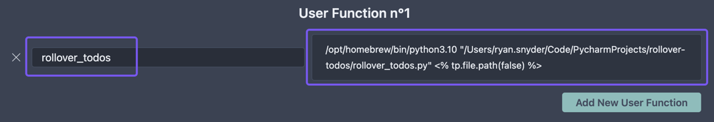

# Rollover Obsidian TODOs in Daily Notes

This is a Python script that can be called from the Obsidian [Templater](https://github.com/SilentVoid13/Templater) 
plugin. Much of this script comes from [obsidian-templater-helpers](https://github.com/JasonBraddy/obsidian-templater-helpers)
but is modified for a daily/periodic note with a custom format (i.e. Thursday, August 25th, 2022). The script looks for
the most recent daily note (doesn't have to be yesterday) and moves any open TODO items to today's daily note.

## Templater Settings & Setup

### Invoke Templater User Command Function from Obsidian
The left side ("rollover_todos") is the name of the function as it should be invoked from a
template. A template can be any note inside a folder that is designated as a template
folder in Templater settings.

Here's the [daily note](daily%20note%20template.md) that I use.

`<% tp.user.rollover_todos() %>` is how the custom function is invoked by Templater.

### Setup User Function
On the right side there are three arguments provided:

1. Python path or command (i.e. `path/to/python3` or simply `python3`).
2. Path to python script.
3. [Templater internal function](https://silentvoid13.github.io/Templater/internal-functions/internal-modules/file-module.html#tpfilefolderrelative-boolean--false) that can be passed to the script.
In this case, `<% tp.file.folder(true) %>` passes the relative path of the note that's invoking the script.